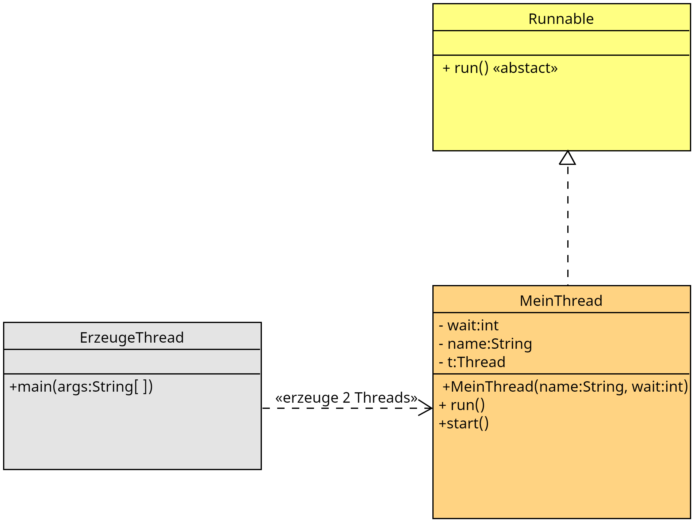

# Threads mit Interface

## Nachteile beim Erben von Thread

Bei der bisherigen Erstellung eines Threads mit Vererbung ist der Nachteil, dass nicht von anderen kalssen geerbt werden kann.

## Vorteil beim Erben von Thread

Verwaltungsmethoden für Threads sind beim erben automatisch verfügbar.

## Übung wie in Ordner 1

1. Erstellender Klassen `ErzeugeThread.java` und `MeinThread.java`
````java
class MeinThread{}

public class ErzeugeThreadMitInterface {}
````

2. Erzeugen Sie die `MeinThread.java` einen Thred mit dem Interface
````java
class MeinThread implements Runnable{}
````

3. Überschreiben Sie die `run()-Methode`
````java
@Override
    public void run() {
        
    }
````

4. Deglarieren Sie ein Threadobjekt `Thread t`
````java
class MeinThread implements Runnable{

    String name;
    int time;
    Thread t;
//...
}
````

5. Erzeugen Sie das threadobjekt im Konstruktor.
````java
public MeinThread(String name, int pWait){
        this.name = name;
        pWait = time;
        t = new Thread(this);
    }
````

6. Deglarieren Sie mit der Methode `start()` den aufruf von `t.start()` an den Thread
````java
public void start(){
        t.start();
    }
````

7. Implementierne Sie den Thread so, dass er das gleiche tut wie in **Aufgabe1**
````java
@Override
    public void run() {
        System.out.println("Name " + name + " gestartet");

        for (int i = 0; i <= 100; i++) {
            System.out.println("Name: " + name + " " + i);
        
            try {
                Thread.sleep(time);
            } catch (Exception e) {
                e.printStackTrace();
            }

        }
    }
````
8. Erzeugen Sie 2 Threads und erzeugen Sie diese.
````java
public class ErzeugeThreadMitInterface {

    public static void main(String[] args) {
        System.out.println("Main-Thread mit Interface gestartet");

        MeinThread a = new MeinThread("a", 100);
        MeinThread b = new MeinThread("b", 30);

        a.start();
        b.start();

        System.out.println("Main-Thread mit Interface zuende");
    }
}
````


>**Merke:** 
> Bei verwendung eines Interfaces kann die eigene Thread-Klasse von einer bestehenden Klasse erben.

## Klassendiagramm

